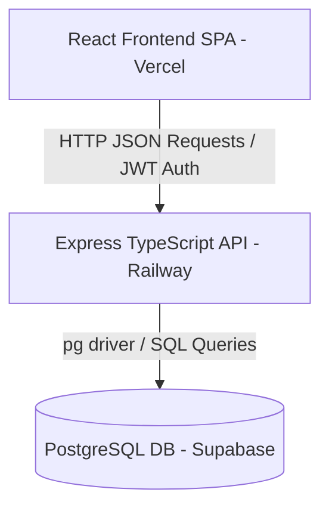
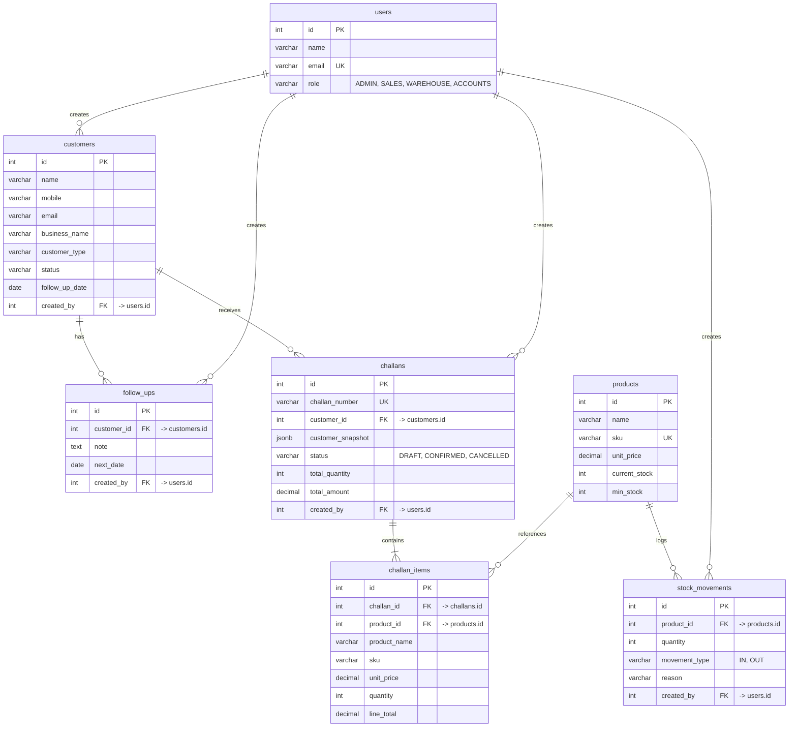

# System Architecture & Design

This document details the architectural design, folder structure, database schema, and transaction boundaries of the **FlowStack ERP + CRM Operations Portal**.

---

## 1. System Design Overview

The application follows a standard decoupled **Single Page Application (SPA)** and **RESTful API** architecture:



- **Frontend**: A client-side React app bundled via Vite. It uses **React Router DOM** for routing and a lightweight custom fetch wrapper to communicate with the backend. User state is persisted in `localStorage`.
- **Backend**: A Node.js + Express REST API written in TypeScript. Route handlers use **Zod** to validate request bodies, and the raw **`pg` (node-postgres)** driver executes queries against PostgreSQL.
- **Database**: PostgreSQL hosted on Supabase. Relational integrity is enforced using foreign keys and unique constraints at the database level.

---

## 2. Directory Layout

The workspace is organized as a monorepo structure:

```text
flowstack/
├── backend/                  # Node.js + Express API
│   ├── db/                   # Database schemas and scripts
│   │   ├── schema.sql        # DB tables and indexes definition
│   │   ├── seed.ts           # Demo users and sample data seed script
│   │   └── migrate.ts        # Script to run schema.sql programmatically
│   └── src/
│       ├── middleware/       # JWT verification & error handling
│       ├── routes/           # REST endpoints (auth, customers, products, stock, challans)
│       ├── db.ts             # PostgreSQL pool initialization
│       └── index.ts          # Server entry point & CORS configuration
├── frontend/                 # React SPA (Vite)
│   ├── public/               # Static assets
│   ├── src/
│   │   ├── components/       # Reusable UI components
│   │   ├── pages/            # View components mapping to routes
│   │   ├── api.ts            # Fetch wrapper and API communication logic
│   │   ├── auth.tsx          # Authentication context provider
│   │   ├── App.tsx           # React UI routing
│   │   ├── main.tsx          # React DOM mounting
│   │   └── styles.css        # Premium dark UI styling and CSS variables
│   └── index.html            # Vite HTML entry point
├── docs/                     # Documentation files
│   ├── API.md                # REST endpoint specifications
│   └── ARCHITECTURE.md       # This file
└── docker-compose.yml        # Local development orchestration
```

---

## 3. Database Schema

The database consists of 6 primary tables: `users`, `customers`, `follow_ups`, `products`, `stock_movements`, `challans`, and `challan_items`.



### Snapshotting Pattern
When a `challan` is created, it captures the customer's details into the `customer_snapshot` column and the product details (name, sku, unit_price) into `challan_items`. This ensures that historical sales orders remain accurate even if the product price or customer details are changed later.

---

## 4. Concurrency & Transaction Management

Since multiple users (Sales, Warehouse) interact with the same product inventory concurrently, strict transaction boundaries and row-level locks are used to prevent race conditions.

### Stock Reductions (Challan Confirmation)
When a Sales rep confirms a challan:
1. `BEGIN` transaction.
2. `SELECT ... FROM products WHERE id = X FOR UPDATE` is executed for each item. This locks the product rows so no other process can modify the stock concurrently.
3. The system checks if `current_stock >= requested_quantity`.
    - If false, the transaction is `ROLLBACK`ed and a `422 Unprocessable Entity` is returned.
4. `UPDATE products SET current_stock = current_stock - quantity`.
5. `INSERT INTO stock_movements` (OUT).
6. `UPDATE challans SET status = 'CONFIRMED'`.
7. `COMMIT` transaction.

This pattern ensures that stock can never accidentally drop below zero due to concurrent sales.
